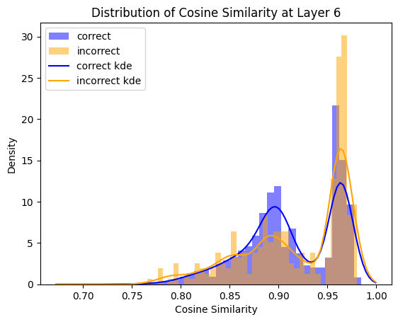

# Monitoring LLM Hallucinations

*Note that this project is ongoing and the current code/write-up does not represent any finalized results.*

An increase in LLM capabilities through scaling and the introduction of reasoning chains has led to fewer hallucinations since the early iterations of GPT models, but they still remain a key hazard as LLM-based AIs are integrated into workflows.
As opposed through decreasing their frequency through enhanced capabilties and fine tuning, an alternative approach is to monitor LLM outputs for hallucination.
Upon detection, the hallucination could be flagged to the user or the model could be prompted to re-generate the affected tokens.
A decreased rate of hallucations leads to safer and more reliable models, enabling greater confidence when deploying upon them for critical tasks.

This project takes a bottom-up approach to hallucinatin monitoring.
By analyzing the hidden embeddings of a transformer model, a monitoring routine can be utilized to detect trends in the path taken by an embedding as it transforms through the model.
Embeddings corresponding to tokens that are factual in nature take a path distinct than embeddings corresponding to hallucinatory tokens, and this divergence can be used to classify tokens which are more likely to be hallucinations.


## *Background*

At the heart of the modern LLM boom is the transformer model architecture.
Fundamentally, transformers are tools designed to accurately predict the next word that will occur after any given sequence of prior words.
They accomplish this by converting tokens, a smaller unit of language than words, into high-dimensional vectors and then performing a series of matrix operations on them, the internal parameters of which are iteratively tweaked such that the last vector at the end of these operations corresponds to a ranked superposition of potential next tokens.


Figure 1: Words represented as vectors in a transformer model. Credit to [3Blue1Brown](https://www.3blue1brown.com/lessons/gpt) for image.


These iterative operations are organized as layers.
Conceptually, each layer should tweak its internal weights so that it embeds additional information about what the predicted token should be into the sequence of vectors flowing through the transformer.
After passing through each layer, the vector for the predicted word should be iteratively transformed into a vector that will produce a high-quality token prediction.


Figure 2: Sequences of vectors passing through layers of a transformer model. Credit to [3Blue1Brown](https://www.3blue1brown.com/lessons/gpt) for image.


[comment]: <> (this is a good point to include lit review)
Comparing the state of these internal vectors after each layer, i.e., at layer $l$ vs. $l+1$, may provide some insight on the information injected into the vectors by each layer.
In this work, I utilize a comparative technique to isolate distinct transformative paths of factual and hallucinated LLM outputs, with a goal of developing a monitoring technique to flag hallucinations before they are shown to a user.
A robust methodology to monitor hallucinated outputs would reduce the risk of unsafe misinformation dissemination and increase trustworthiness of LLMs.


## *Data & Methodology*

### Datasets
Assessing whether an LLM output is a hallucination is not a trivial task in most circumstances.
In order to guarantee that data are labelled accurately, I limit the scope of this project to simple math problems.
This work uses two datasets of addition problems: one comprised of outputs where the LLM correctly solves the problem and one where it does not.

All LLM inputs are of the form
```
The sum of {int1} and {int2} equals
```
The `int` variables range from $10^2$ to $10^7$.
Since transformers output one token at a time, and each token is a single digit number, the quantity of data points can be increased by generating them recursively.
For example, the input
```
The sum of 1 and 12 equals
```
will produce `1` first, leading to
```
The sum of 1 and 12 equals 1
```
which leads to `3` for the next token. Both of these outputs are a unique data point. If the prediction is correct, the data point is binned in the "Factual" dataset, and in the "Hallucination" dataset if not.
There is significant class imbalance between the two, with the Factual dataset containing 24637 records and the Hallucination dataset containing 363 records.
Each dataset is separated into training and testing splits with a test data fraction of 20%.

### Model
To remain within computational limitations, I used the Qwen3 4 billion parameter base model and its associated tokenizer.
Due to its small size, it is worth noting that hallucinations will be more common than flagship models, even for simple math.

### Tracing Transformative Paths
Cosine similarity is a popular measure of similarity between two vectors.
Two vectors pointing in the same direction will have a cosine similarity value of +1 or -1 if they point in the exact opposite directions.
A value of 0 indicates the two vectors point in direction orthogonal to each other.


Figure 3: The range of values possible for cosine similarity between two vectors. Credit to [LearnDataSci](https://www.learndatasci.com/glossary/cosine-similarity/) for image.


Of all the hidden vectors, the last one in the last hidden state is of particular importance:
It is the only vector that is ultimately converted back to a token.
As such, it is an obvious candidate for tracing similarity throughout layers.
For each data record, I compare the cosine similarity of the last vector of each hidden state to the last vector of the prior hidden state.
Aggregating cosine similarity values across each dataset produces trends common across all addition problems represented in the data.

### Kernel Density Estimation
Distributions of each dataset at each layer are smoothed using a density esimation routine with a Gaussian kernel.
The bandwidth parameter of the Gaussian kernel is chosen by searching for a value (search range: $10^{-2}$ to $10^{-1}$) that optimizes the log-likelihood of a fit.

### Classification Models
I test various classification methods: naive probability aggregation, support vector machines, random forest, and gradient boosted trees.
Each method has its own hyperparameters and I attempt to determine ideal combinations for each through  trial-and-error.


## *Results*



Figure 4: Comparison of the distributions of Factual ("correct") and Hallucination ("incorrect") cosine similarities for an example layer.

Using the nonparametric Kolmogorov–Smirnov equality test to compare distributions at all monitored layers (e.g., Figure 4) reveals that the distributions are often statistically different.
Between 15 to 20 of the 34 total layers monitored reject the null hypothesis (p value < 0.05), depending on the exact training/testing data split.

With the exception of probability aggregation, all classification models perform at a comparable level.
See Appendix B for code, confusion matrices, and summary statistics.
Due to the severe class imbalance, metrics like recall and precision are more meaningful than overall accuracy (predicting all inputs as Factual gives an accuracy of ~98.5%, but will not catch any hallucinations).
Of the two metrics, models tend to perform stronger in the recall metric, hovering around 70-80%.
This indicates an automated monitoring routine that catches most hallucinations is feasible, but its trustworthiness is negatively impacted by the poor precision of these classification models (5-8%).


## *Discussion*

The statistically significant distinctions between distributions at various monitoring sites in a transformer (e.g., Figure 4) show that there is potential with this technique for identifying hallucinations before they are presented to a user.
If Factual/Hallucination datasets manifest as different distributions, the likelihood of a new point corresponding to either dataset may be quantifiable.

To make these results more usable in general, this work needs to be extended to natural language situations.
Building hallucination vs. factual datasets becomes more difficult in this case, since unlike math problems, which have a defined correct/incorrect answer, natural language is often more ambiguous.
A preliminary step could be to build datasets of completions that will have a definite correct answer.
For example, the completion
```
The capital city of France is
```
has a well-defined correct answer of `Paris`.
Generalizing beyond simple message templates is also needed.

Another necessary step in generalizing these results is to analyze transformative paths in different models.
This work uses a Qwen3 base model, which are not the LLMs consumers interact with on sites like ChatGPT.
Those have been fine tuned beyond their pretraining and so they may have weights that lead to different transformative paths than those seen in base models.
Consumer grade LLMs are also much larger than the 4 billion parameter model used here.
Both of these shortcomings are straightforward to address with additional computational resources.